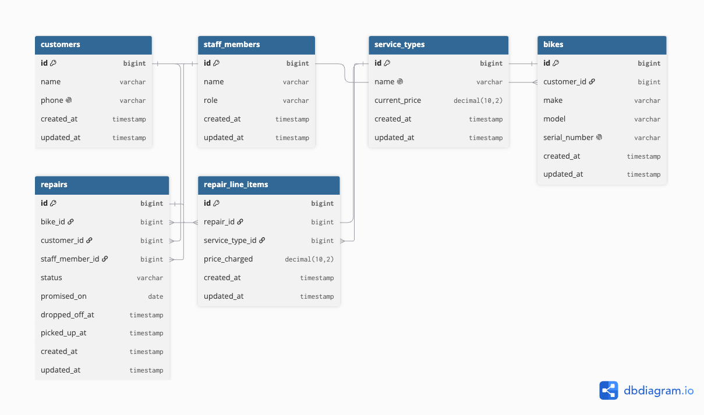

# Domain Model



```dbml
Table customers {
  id integer [pk, increment]
  name varchar
  phone varchar [unique]
}

Table bikes {
  id integer [pk, increment]
  customer_id integer
  make varchar
  model varchar
  serial_number varchar [unique]
}

Table staff_members {
  id integer [pk, increment]
  name varchar
  role varchar
}

Table service_types {
  id integer [pk, increment]
  name varchar
  current_price decimal
  updated_at date
}

Table repairs {
  id integer [pk, increment]
  bike_id integer
  customer_id integer
  status varchar
  dropped_off_at datetime
  promised_at date
  picked_up_at datetime
}

Table repair_line_items {
  id integer [pk, increment]
  repair_id integer
  service_type_id integer
  price_charged decimal
}

Table notes {
  id integer [pk, increment]
  repair_id integer
  staff_member_id integer
  content text
  created_at datetime
}

Table photos {
  id integer [pk, increment]
  repair_id integer
  file_path varchar
  taken_at datetime
}

Ref: bikes.customer_id > customers.id
Ref: repairs.bike_id > bikes.id
Ref: repairs.customer_id > customers.id
Ref: repair_line_items.repair_id > repairs.id
Ref: repair_line_items.service_type_id > service_types.id
Ref: notes.repair_id > repairs.id
Ref: notes.staff_member_id > staff_members.id
Ref: photos.repair_id > repairs.id
```

## Relationships

- One customer can own many bikes — one bike currently belongs to one customer.
- One bike goes through many repairs over its life — each repair belongs to exactly one bike.
- One customer can be tied to many repairs — each repair records the customer who dropped that bike off for that visit.
- One repair can have many line items (a bike usually needs two or three jobs) — each line item belongs to exactly one repair and points at exactly one service type.
- One service type can appear on many line items across many repairs.
- One repair can have many notes, written by different staff members over time.
- One repair can have many photos.

## Lifecycle

A repair's `status` moves through these states:

1. `dropped_off` — bike is tagged and on the rack, no mechanic has looked at it yet.
2. `diagnosing` — a mechanic is examining it and writing the note.
3. `awaiting_approval` — the mechanic quoted a price and is waiting for the customer's yes or no.
4. `in_progress` — the customer approved the quote, or the job was trivial enough to skip approval.
5. `declined` — the customer said no to the quote.
6. `ready` — the work is finished, waiting for pickup.
7. `picked_up` — the bike has left the shop, repaired or not.

**Allowed transitions:** `dropped_off → diagnosing`, `diagnosing → awaiting_approval`, `diagnosing → in_progress` (trivial job), `awaiting_approval → in_progress`, `awaiting_approval → declined`, `in_progress → ready`, `ready → picked_up`, `declined → picked_up`.

**Not allowed, and why:**

- `dropped_off → ready` or `dropped_off → in_progress` — nothing has been diagnosed yet, so there's nothing to approve or work on.
- `declined → in_progress` — once the customer said no, there's no approval to do paid work; a customer who changes their mind starts a new repair instead.
- `ready → in_progress` or `picked_up → anything` — a picked-up bike is out of the shop's hands, and a ready bike shouldn't quietly go back to being worked on without that showing up as a new repair.

## Every entity traces back to a story

| Entity | Story it's required by |
|---|---|
| `customers` | Story 1 — record name and phone at drop-off |
| `bikes` | Story 2 — record serial number and model |
| `staff_members` | Story 4 — mechanic writes a note; story 11 — owner's dashboard |
| `service_types` | Story 14 — price list is public; story 6 — jobs added from the list |
| `repairs` | Story 10a — status lookup; story 5 — awaiting approval |
| `repair_line_items` | Story 6 — jobs added from the price list; story 13 — price snapshot |
| `notes` | Story 4 — readable diagnosis |
| `photos` | Story 3 — photos at intake |

## Two decisions you have to defend

**The thing and the copy of the thing.** `bikes` is its own table, keyed on a unique `serial_number`, separate from `repairs`. A repair is a *visit*; a bike is a *physical object* that can have many visits over years. That separation is what stops the March mix-up: two blue Marlins are two rows in `bikes` with two different serial numbers, so a repair always points at one exact bike. A single table with a quantity column could tell you how many bikes came in, but not which one is which when it's time to hand one back.

**Derived, or stored?** Whether a repair is overdue isn't stored anywhere — it's derived by comparing `repairs.promised_at` to today's date whenever the dashboard loads, since storing it would go stale the moment a day passes. On the other hand, `repair_line_items.price_charged` looks derivable — "just look up the service type's price" — but it's stored on purpose, because `service_types.current_price` changes every January, and if a line item only pointed at the service type without a stored price, last year's invoices would silently reprice themselves the moment the list changes.