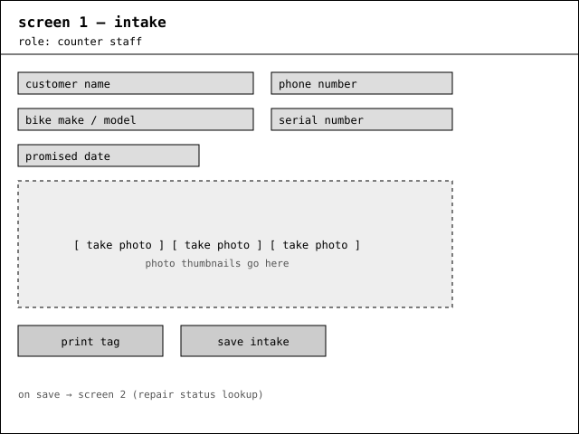
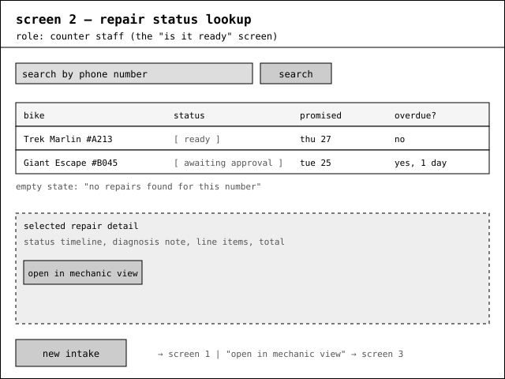
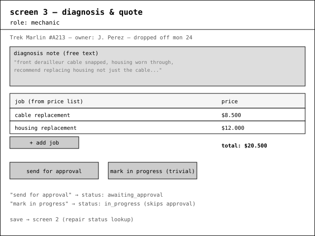
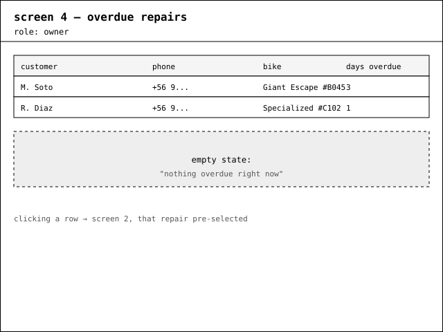
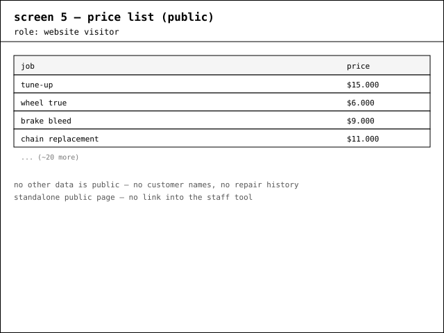
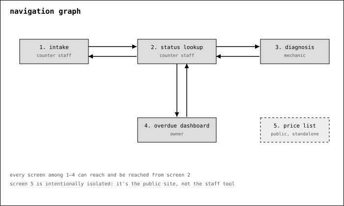

# Wireframes

Five screens, low fidelity, drawn as grey boxes.

## 1. Intake — counter staff

Where a repair starts: customer name and phone, bike make/model and serial number, promised date,
photos of the bike as it arrives.

## 2. Repair status lookup — counter staff

**This is the counter screen that answers "is this bike ready."** Search by phone number, see status
and whether it's overdue.

## 3. Diagnosis and quote — mechanic

The mechanic's note, the jobs added from the price list, and the running total.

## 4. Overdue repairs — owner

Every repair whose promised date has passed and hasn't been picked up.

## 5. Price list — website visitor (public)

The wall list, online. Nothing else is public.

## Navigation graph

Every staff screen (1–4) can both reach and be reached from screen 2, so none of them is a dead end.
The public price list is deliberately isolated — it's a separate public page, not part of the staff
tool.
